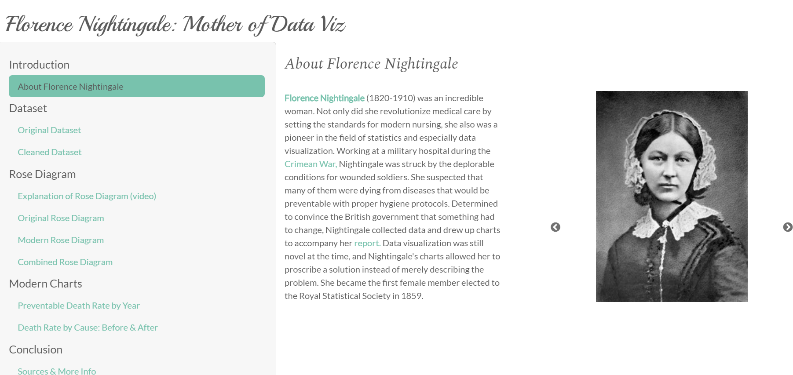
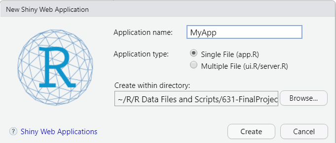
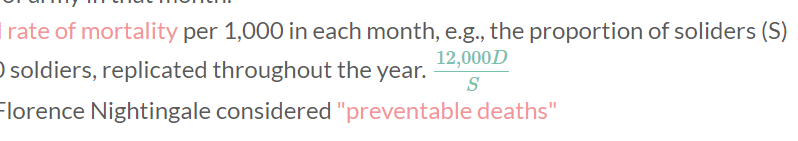
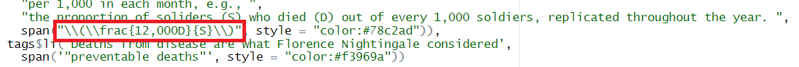

```{r setup, include=FALSE}
knitr::opts_chunk$set(echo=TRUE, tidy.opts=list(width.cutoff=50),tidy=TRUE) 
```

# \textcolor{WildStrawberry}{INTRODUCTION}

**[Florence Nightingale](https://en.wikipedia.org/wiki/Florence_Nightingale)** (1820-1910) was an incredible woman. Not only did she revolutionize medical care by setting the standards for modern nursing, she also was a pioneer in the field of statistics and especially data visualization. Working at a military hospital during the [Crimean War](https://en.wikipedia.org/wiki/Crimean_War), Nightingale was struck by the deplorable conditions for wounded soldiers. She suspected that many of them were dying from diseases that would be preventable with proper hygiene protocols. Determined to convince the British government that something had to change, Nightingale collected data and drew up charts to accompany her [report](https://curiosity.lib.harvard.edu/contagion/catalog/36-990101646750203941). Data visualization was still novel at the time, and Nightingale's charts allowed her to proscribe a solution instead of merely describing the problem. She became the first female member elected to the Royal Statistical Society in 1859.
            
## \textcolor{TealBlue}{What:}

My goal for this project was to create an R Shiny dashboard celebrating Florence Nightingale's contributions to stats and data analysis and exploring her work.

## \textcolor{TealBlue}{Why:}

Florence Nightingale is arguably the mother of data viz, and I thought it would be interesting to see what sort of modern data visualizations I could create using her [historical data](https://github.com/vincentarelbundock/Rdatasets/blob/master/csv/HistData/Nightingale.csv). I also wanted more people to know about this amazing woman who deserves a place next to Ada Lovelace in the pantheon of influential women in STEM.

## \textcolor{TealBlue}{How:}

Using Florence Nightingale's data that she collected during her time at the military hospital, I created a web app using R Shiny that allows users to see her original data visualizations next to modern recreations.

\newpage

# \textcolor{WildStrawberry}{CREATING THE APP}

**Link to the app: https://e11i3n0r.shinyapps.io/631-EllieByler-FinalProject/**

```{r, echo=FALSE, fig.align = "center", out.width="100%"}

```

## \textcolor{TealBlue}{Getting Started:}

Creating an app using R Shiny is surprisingly simple. First, install the Shiny package using `install.packages("shiny")` in your R console. Select `File → New File → Shiny Web App` in RStudio and save it to a new folder directory on your computer.

```{r, echo=FALSE, fig.align = "center", out.width="60%"}

```

Here is the minimal code necessary to create a functioning app:

```{r minimal shiny code, eval=FALSE}

# use install.packages("shiny") first if it's not installed

library(shiny)

# UI SECTION
ui <- fluidPage(
  "Hello, world!"
)

# SERVER SECTION
server <- function(input, output) {
}

shinyApp(ui, server)
```

There are only two main components: the UI and the Server. Of course, within that basic framework, there is much room for added customization and complexity. I was able to format a navigation sidebar, include data tables and graphs, embed videos and audio, and use a custom theme ([Bootswatch: "Minty"](https://bootswatch.com/minty/)) and fonts.

## \textcolor{TealBlue}{Cleaning and Prepping the Data:}

I found a dataset on Github of Florence Nightingale's data collected over two years during her time as a nurse in the Crimean War. It is a small dataset with only 24 records (each record represents a month), which goes to show that even limited datasets can prove useful for analysis. Nightingale's original data table is shown below.

**Link to dataset: https://github.com/vincentarelbundock/Rdatasets/blob/master/csv/HistData/Nightingale.csv**

```{r, echo=FALSE, fig.align = "center", out.width="80%"}
knitr::include_graphics("florence_data_table.png")
```

\newpage

```{r load data, message=FALSE, warning=FALSE, paged.print=FALSE}
# LOAD DATA

library(readxl) # for loading dataset from Excel file.

Nightingale <- read_excel("DATASET_Nightingale.xlsx", sheet = "Nightingale")
```

After loading the dataset, it needed substantial modifications to make the types of charts that I needed.

```{r data prep, message=FALSE, warning=FALSE, paged.print=FALSE}
# PREP DATA FOR ANALYSIS

library(magrittr) # adds operators that make function sequencing easier.
library(tidyverse) # for data manipulation and visualization.
library(stringr) # for text processing.
library(zoo) # for date-time processing.
library(lubridate) # for date-time processing.

Nightingale %>%
  select(-c("ID")) %>%
  pivot_longer(cols = c("Disease", "Wounds", "Other"), names_to = c("Cause"), values_to = c("Deaths")) %>%
  mutate(Rate = if_else(.$Cause == "Disease", .$Disease.rate, if_else(.$Cause == "Wounds", .$Wounds.rate, .$Other.rate))) %>%
  select(-c("Disease.rate", "Wounds.rate", "Other.rate")) %>%
  mutate(Rate = round((Rate/12), 2)) %>%
  unite("Month_Year", Month:Year, sep=" ", remove=FALSE) %>%
  mutate(Regime = if_else(str_detect(.$Month_Year, "[:alpha:]\\s1854"), "Before", if_else(str_detect(.$Month_Year, "(Jan|Feb|Mar)\\s1855"), "Before", "After"))) %>%
  mutate(Regime = factor(Regime, levels = c("Before", "After"))) %>%
  mutate(Sort_Date = as.yearmon(as.Date(Date))) %>%
  mutate(mo = month(Date, label = TRUE, abbr = TRUE)) -> long_data
```

The main things accomplished by the code above are pivoting the data so that `Deaths`, `Cause`, and `Rate` are single columns instead of having `Disease.rate`, `Wounds.rate`, etc. I also added a column called `Regime` that has values of "*Before*" or "*After*" based on the date. This refers to when a Sanitary Commission arrived at the hospital in March 1855 to help implement hygiene practices that drastically reduced preventable deaths from disease among wounded soldiers.

## \textcolor{TealBlue}{Data Visualizations:}

For reference, I've included the graphic that inspired this project on the next page: Nightingale's famous chart depicting the causes of mortality in the British army during the Crimean War from April 1854 to March 1856. This *rose diagram* is alternatively called a *coxcomb* or a *polar area chart*. 

\newpage

### *Florence Nightingale's Original Rose Diagram & Explanatory Text:*

DIAGRAM of the CAUSES of MORTALITY in the ARMY in the EAST

Figure 1: APRIL 1854 to MARCH 1855  
Figure 2: APRIL 1855 to MARCH 1856

```{r, echo=FALSE, fig.align = "center", out.width="90%"}
knitr::include_graphics("Rose_Diagram_rmd.jpg")
```

* The areas of the \textcolor{MidnightBlue}{blue}, \textcolor{Sepia}{red}, & black wedges are each measured from the center as the common vortex.
* The \textcolor{MidnightBlue}{blue} wedges measured from the center of the circle represent area for area the deaths from \textcolor{MidnightBlue}{Preventable or Mitigable Zymotic diseases}, the \textcolor{Sepia}{red} wedges measured from the center the deaths from \textcolor{Sepia}{wounds}, & the black wedges measured from the center the deaths from all other causes.
* The black line across the \textcolor{Sepia}{red} triangle in Nov. 1854 marks the boundary of the deaths from all other causes during the month.
* In October 1854 & April 1855, the black area coincides with the the \textcolor{Sepia}{red}, in January & February 1856, the \textcolor{MidnightBlue}{blue} coincides with the black.
* The entire areas may be compared by following the \textcolor{MidnightBlue}{blue}, the \textcolor{Sepia}{red}, & the black lines enclosing them.

\newpage

### *Modern Recreation of the Rose Diagram*

For my first recreation of the rose diagram using R, I modified code from this site: https://rpubs.com/chidungkt/819554. This is a fairly faithful copy of the original, with similar coloring and layout. The main differences are that the "*Before*" panel has been moved to the left of the "*After*" panel, since this makes more sense with how people tend to think about the passage of time. The graphs are also flipped on the horizontal axis, with January at the top of the circle instead of at the bottom. I discovered that a rose diagram/coxcomb plot is just a bar chart with polar coordinates.

```{r modern rose1, fig.align = "left", out.width="90%", message=FALSE, warning=FALSE, paged.print=FALSE}
# MODERN ROSE DIAGRAM
long_data %>% 
      ggplot(aes(x = mo, y = Deaths, fill = Cause)) +
      geom_col(color = "grey20") + 
      scale_fill_manual(values = c("#6cc3d5", "#7C8083", "#f3969a"), name = "") +
      scale_y_sqrt() +
      facet_wrap(~ Regime) + 
      coord_equal(ratio = 1) +
      coord_polar() +
      labs(title = "Causes of Mortality in the Army in the East", 
           subtitle = "BEFORE and AFTER March 1855",
           caption = "Data Source: Deaths from various causes in the Crimean War") +
      theme(legend.position = "top") + 
      theme(text = element_text(size = 12)) + 
      theme(axis.title.y = element_blank()) + 
      theme(axis.title.x = element_blank()) + 
      theme(axis.text.y = element_blank()) + 
      theme(axis.ticks = element_blank()) + 
      theme(plot.margin = unit(rep(0.7, 4), "cm")) + 
      theme(plot.title = element_text(color = "#78c2ad", size = 16, face="bold")) + 
      theme(plot.caption = element_text(color = "grey70", size = 10)) + 
      theme(plot.subtitle = element_text(color = "#7C8083", size = 12, face="bold")) +
      theme(legend.text = element_text(color = "black", size = 10)) + 
      theme(strip.text = element_text(color = "black", size = 12, face = "bold", hjust = 0.5))
```

\newpage

### *Combined Rose Diagram: 24 Months*

Next, I wanted to try to create a single rose diagram that shows all two years of data on a single set of coordinates, as though it were a 24-hour clock. Additionally, it would only show the changes in the death rate from disease, since Nightingale was most interested in preventable deaths. I was inspired by this [site](https://www.r-bloggers.com/2013/01/going-beyond-florence-nightingales-data-diagram-did-flo-blow-it-with-wedges/). However, I could not get their code to work, so I modified my rose diagram code from above instead.

```{r subset}
# CREATE SUBSET FOR COMBINED ROSE DIAGRAM
long_data %>%
  select(-c("Date", "Month_Year", "Month", "Year", "Army", "Rate", "mo")) %>%
  subset(Cause == "Disease") -> sub_long
```

```{r combo rose, fig.align = "left", out.width="90%", message=FALSE, warning=FALSE, paged.print=FALSE}
# COMBINED ROSE DIAGRAM
sub_long %>% 
      ggplot(aes(x = factor(Sort_Date), y = Deaths, fill = Regime)) +
      geom_col(color = "grey20") + 
      scale_fill_manual(values = c("#6cc3d5", "#4b8c99"), name = "") +
      scale_y_sqrt() +
      coord_equal(ratio = 1) +
      coord_polar() +
      labs(title = "Deaths from Preventable Causes", 
           subtitle = "BEFORE and AFTER March 1855") +
      theme(legend.position = "top") + 
      theme(text = element_text(size = 10)) + 
      theme(axis.title.x = element_blank()) + 
      theme(axis.title.y = element_blank()) + 
      theme(axis.text.y = element_blank()) + 
      theme(axis.ticks = element_blank()) + 
      theme(plot.margin = unit(rep(0.7, 4), "cm")) + 
      theme(plot.title = element_text(color = "#78c2ad", size = 16, face="bold")) + 
      theme(plot.subtitle = element_text(color = "#7C8083", size = 12, face="bold")) +
      theme(legend.text = element_text(color = "black", size = 10))
```

I also created two modern charts using the same dataset: a bar chart comparing deaths from all three causes (`Disease`, `Wounds`, `Other`) between the "*Before*" period and the "*After*" period, and a line chart that explores the trend in preventable deaths from disease over the two year period. These charts can be seen on the Shiny app website: https://e11i3n0r.shinyapps.io/631-EllieByler-FinalProject/


# \textcolor{WildStrawberry}{TOPICS FROM CLASS}


## \textcolor{TealBlue}{1. Github:}

Github is a skill that I had been meaning to learn at some point, but I never had a good opportunity to do it until this class. There are still many mysteries to be uncovered, but I have gotten the hang of using `push` and `pull` for version control management. Having a Github account set up will be useful for any future coding projects I do, and I like having the project for this course publicly available in case I would like to use it in a portfolio.

## \textcolor{TealBlue}{2. R Markdown:}

We have obviously been using R Markdown all semester, and I've really gotten the hang of it. However, I never realized how specific of a coding style it is until I had been working on my Shiny app code for a while and then switched back to R Markdown. Markdown has some very specific syntax, and I had to modify some of my app code to get it to work in the pdf. I've used flavors of Markdown on other sites (e.g., Discord and Slack use some variation of Markdown to let you format text as bold, italic, etc.).

## \textcolor{TealBlue}{3. R Shiny:}

This project wouldn't have existed without R Shiny. We didn't cover this topic in class, but I had noticed the option in the File menu to create a Shiny Web App, and I was excited to learn more. As the minimal functional code above shows, the basics of Shiny app creation are super simple to master. It took a little more trial-and-error and tutorials to figure out exactly what to include where to make the app look how I wanted, but there were numerous detailed web resources. I thought it was interesting that a lot of the code is actually html that is generated by R.

## \textcolor{TealBlue}{4. Tidyverse (ggplot2, dplyr, tidyr, stringr, etc.):}

The tidyverse package was integral to my project. The time we spent in class going over how to use `ggplot` aided my comprehension of the code for the rose diagram and how I would need to modify it to make a combined rose diagram. It also made it easy to add a grouped bar chart and a paneled line chart (using `facet_wrap`). The original dataset was clean, but it was far from normalized or "tidy" and this package made it almost as easy to pivot the data in R as it would be in Excel.

There are other packages I used that are associated with the tidyverse but need to be installed separately. These include `readxl` for loading in the `.xlsx` data, `lubridate` for handling dates, and `magrittr` for providing the special tidyverse pipe `%>%`.

## \textcolor{TealBlue}{5. Assorted other topics: Regex, MathJax, Bootstrap, etc.:}

I was a little surprised by how many other topics I ended up using in my project. These were topics that weren't covered in class, but are easy enough to figure out once you have experience with R. I used `regex` in my data preparation to assign the variable `Regime` to the records based on their date.

```{r regex, eval=FALSE}

mutate(Regime = if_else(str_detect(.$Month_Year, "[:alpha:]\\s1854"), "Before", if_else(str_detect(.$Month_Year, "(Jan|Feb|Mar)\\s1855"), "Before", "After")))
```

I used `MathJax` to format an inline equation like one would with `LaTeX`.

```{r, echo=FALSE, fig.align = "center", out.width="90%"}

```

```{r, echo=FALSE, fig.align = "center", out.width="90%"}

```

And lastly, I used Bootstrap to customize my website using the object `bslib::bs_theme()` and a theme called "Minty" from [bootswatch.com](https://bootswatch.com/).


# \textcolor{WildStrawberry}{CONCLUSION}

Overall, I am very pleased with how this app turned out. I've created websites before using website creation platforms before, but this is the first time I've made a page that I coded from scratch. There are some issues with the layout that I would fix if I had more time, for instance the picture slideshow on the Introduction page looks bad if the screen is too narrow, which would be a problem for mobile phones. Shiny has options to make a layout more responsive, but then you have to sacrifice having the charts look exactly how you want. I also would have loved to make the app more interactive based on user input using Shiny's [widget gallery](https://shiny.rstudio.com/gallery/widget-gallery.html), however I discovered that with the dataset I chose, the user wouldn't gain much additional insight by being able to (i.e.) select the year from a drop-down menu. Other datasets would be better suited to selection inputs. As a trade-off, I instead focused on making the site as user-friendly as possible, with aesthetic design, informational videos, clearly labeled navigation panel, and tables that let the user examine the datasets for themselves. In the end, the important thing is that I accomplished my goal of creating a functioning R Shiny app that recreates Florence Nightingale's rose diagram, explains the historical context, and leaves the user with a better appreciation of this remarkable woman.

\newpage

# \textcolor{WildStrawberry}{SOURCES}

* **Mathematics of the Coxcombs:**  
http://understandinguncertainty.org/node/214
    + Explains how rose/coxcomb/polar area charts work, as well as how Florence calculated death rate as "annual rate of mortality per 1000 in each month"

* **Florence Nightingale’s Rose Diagram:**  
https://rpubs.com/chidungkt/819554
    + Inspiration and code base for modern recreation of rose diagram.

* **Nightingale Dataset:**  
https://github.com/vincentarelbundock/Rdatasets/blob/master/csv/HistData/Nightingale.csv
    + Original dataset from Github.

* **Wikipedia: Florence Nightingale:**  
https://en.wikipedia.org/wiki/Florence_Nightingale
    + Source of Florence Nightingale portraits and sound recording.

* **Bootswatch Themes: Minty:**  
https://bootswatch.com/minty/
    + Theme for Shiny app.

* **Going Beyond Florence Nightingale's Data Diagram: Did Flo Blow It with Wedges?:**  
https://www.r-bloggers.com/2013/01/going-beyond-florence-nightingales-data-diagram-did-flo-blow-it-with-wedges/
    + Inspiration and code base for combined rose diagram.

* **Florence Nightingale's Forgotten Legacy: Public Health laws:**  
http://www.florence-nightingale-avenging-angel.co.uk/blog/?page_id=462
    + Historian explains the rose diagram.